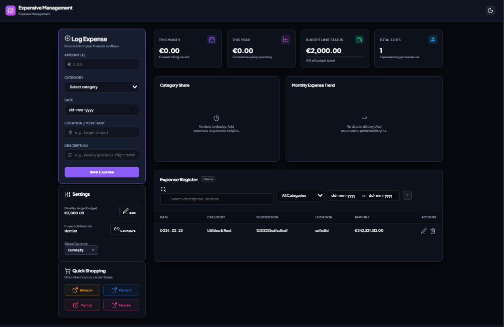

# 🛰️ anti-gravity

`anti-gravity` is a premium Node.js-based CLI tool designed to instantly scaffold and deploy a zero-gravity, high-performance, and visually stunning client-side **Expense Management App** in your current working directory.

Featuring custom glassmorphism design, dual-theme customization, real-time analytics, and interactive Chart.js visualizations, the generated app is fully functional out of the box using client-side LocalStorage for data persistence.

---

## 📸 Application Preview

Below is a sneak peek of the visually rich, responsive glassmorphic user interface:

<!-- Replace 'your-image-url.png' with your uploaded GitHub image link or local path -->



---

## 🚀 Features of the Scaffolded Web App

- **Complete Expense Registry (CRUD):** Log, edit, and remove expense records seamlessly with smooth interactive states.
- **Granular Records Tracking:** Each expense logs **Amount**, **Category**, **Date**, **Merchant / Location**, and **Description**.
- **Real-time Analytics Dashboard:**
  - Displays dynamic Monthly & Yearly total spending statistics.
  - Interactive **Category Breakdown** (Doughnut Chart) powered by Chart.js.
  - Interactive **Expense Trend** (Line Chart) tracking the last 6 months of data logs.
- **Target Budget Controls & Alerts:** Set monthly budgets. The UI dynamically shifts to warning colors and triggers pulse/shake animations as you approach or exceed your goals.
- **🔀 Global Currency Dropdown Select:** Integrated a beautifully customized, premium dropdown menu matching the app theme that lets you dynamically switch global currency symbols across the entire analytics panel.
- **🛍️ Quick Shopping Links Grid:** A dedicated, brand-integrated grid featuring styled quick buttons for **Amazon, Flipkart, Myntra, and Meesho** to cross-reference transactions instantly.
- **⚡ High-Contrast Interaction Engine:** Enhanced crisp table row hovers that instantly elevate active logs with bright slate contrast backgrounds for effortless data scannability.
- **Responsive Visuals:** Flawless glassmorphism layout tailored for mobile, tablet, and desktop monitors, featuring modern system-wide Dark/Light mode switching.

---

## 🛠️ CLI Installation & Execution

Follow these instructions to set up the CLI tool and scaffold the Expense Web App:

### Option A: Local Execution (No Global Installation)

If you want to run the script directly from the source directory:

1. Navigate to the root directory where the codebase was generated.
2. Run the executable using Node.js:
   ```bash
   node cli.js
   ```
